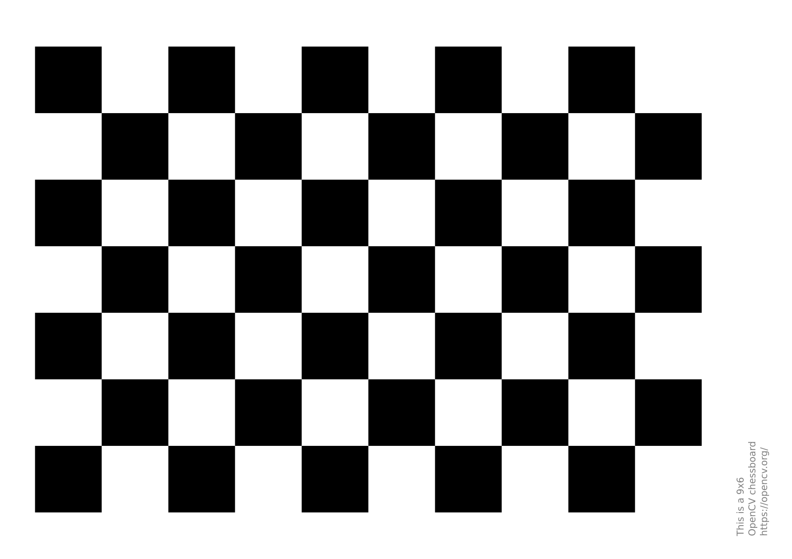
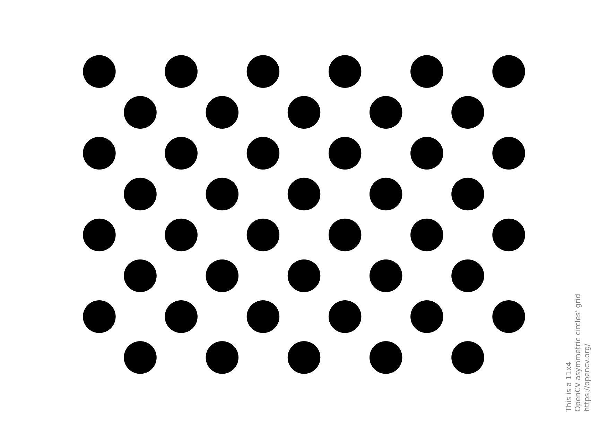

笔记参考知乎上的[**OpenCV 双目摄像头标定+测距教程**](https://zhuanlan.zhihu.com/p/685376354)
# 相机标定
参考 [**OpenCV 教程**](https://docs.opencv.ac.cn/4.12.0/d9/df8/tutorial_root.html)中的[**相机标定和 3D 重建（calib3d 模块）**](https://docs.opencv.ac.cn/4.12.0/d6/d55/tutorial_table_of_content_calib3d.html)
## 创建标定图案
OpenCV官网的**棋盘图案**和**圆圈板图案**如下：
- [**棋盘图案**](https://github.com/opencv/opencv/blob/4.x/doc/pattern.png)
**9 行 6 列，正方形尺寸为 20 mm**

- [**圆圈板图案**](https://github.com/opencv/opencv/blob/4.x/doc/acircles_pattern.png)

## 使用正方形棋盘进行相机标定
### 单目标定
&emsp;&emsp;在进行**双目标定**之前，先要进行**单目标定**。标定主要用到 OpenCV 的 3 个函数： `findChessboardCorners`、`cornerSubPix`、`calibrateCamera`。
- `findChessboardCorners`
  该函数用于在图像中**检测棋盘格角点**。输入参数如下：
  - `image` : 输入的**灰度图像**。
  - `patternSize`：**棋盘格的行列数（内角点数）**，如 (6,9)。
  返回值：**是否找到角点**和**角点的坐标列表**。
- `cornerSubPix`
  该函数用于对**检测到的角点位置**进行**亚像素级精确化**。
- `calibrateCamera`
该函数的作用是根据**一组已知的三维世界坐标点**和对应的**二维图像坐标点**，**计算相机的内参（如焦距、主点）和畸变系数**，从而实现相机的几何校正。常用于立体视觉、测距等场景。

**单目标定**需要得到以下参数：

- **相机内参**
相机**横纵焦距** $f_x,f_y$ 和**主点坐标** $c_x,c_y$。
**一般焦距不大于 4000**。
- **相机畸变参数**
  - **径向畸变参数** $k_1、k_2、k_3$。
  - **切向畸变参数** $p_1、p_2$。
- **旋转向量**
- **平移向量**
- **重投影误差**
重投影误差**越小越好，一般不要大于 1**。
### 双目标定
&emsp;&emsp**双目标定**用到了 OpenCV 的 `stereoCalibrate` 函数：
`stereoCalibrate()` 根据两台相机各自的**内参**、**畸变系数**、**棋盘格角点**对应关系，计算两台相机之间的**旋转矩阵 R、平移向量 t、本质矩阵和基础矩阵**，从而实现双目相机的**空间几何关系恢复**。
**双目标定**需要得到以下参数：
- **旋转矩阵**
- **平移矩阵**
- **本质矩阵**
- **基本矩阵**
- **重投影误差**
## 立体校正
&emsp;&emsp;**立体校正**的意义：
- 矫正畸变的摄像头画面
- 对齐两个摄像头的画面高度
- 让两个画面中的任意一个物体在画面中高度Y轴相等，只有X轴位置有不同，从而**计算视差**。
&emsp;&emsp;**立体校正**分为两个步骤：**计算立体校正参数**和**执行立体校正**。