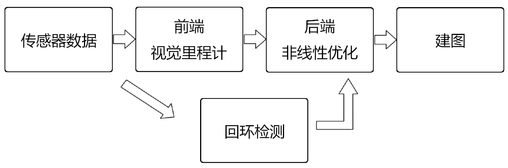

# 初识 SLAM
各种相机在做 SLAM时的特点
- **单目相机**
&emsp;&emsp;单目相机的数据就是照片。照片**以二维形式记录三维世界**。显然，这个过程丢失了场景的一个维度——**深度(距离)**。我们无法通过单张图片计算场景中物体与相机之间的**距离**。**距离**是 SLAM 中非常关键的信息。
&emsp;&emsp;要想**恢复三维结构**，必须**改变相机视角**。在**单目 SLAM**中，我们必须移动相机才能估计它的运动。
&emsp;&emsp;单目 SLAM 具有**尺度不确定性**。
- **双目相机和深度相机**
&emsp;&emsp;使用**单目相机**和**深度相机**的目的是测量物体到相机的**距离**。一旦知道距离，三维结构就能恢复，同时消除**尺度不确定性**。
  - **双目相机**
双目相机测量的距离范围与**基线**相关。基线距离越大，能够测量到的物体越远。双目相机的缺点是**配置与标定**较为复杂，**视差**的计算需要使用 GPU 设备加速，才能实时输出整张图像的距离信息。
  - **深度相机**
深度相机，即 RGB-D 相机，特点是通过**红外结构光**或 **ToF** 原理，像激光传感器那样，主动测量物体与相机之间的距离。局限性比较大。

SLAM 不是某种算法，它需要一个**完善的算法框架**。
## 2.2 视觉 SLAM 框架
经典的视觉 SLAM 框架如图：

视觉 SLAM 的流程如下：
1. **传感器信息读取**
2. **前端视觉里程计**
视觉里程计的任务是**估算相邻图像间相机的运动**，以及**局部地图**的样子。
3. **后端（非线性）优化**
**后端**接受不同时刻**视觉里程计**测量的**相机位姿**，以及**回环检测**的信息，对它们进行优化，得到**全局一致的轨迹和地图**。
4. **回环检测**
回环检测用于判断**是否到过先前的位置**。如果检测到回环，则将信息提供给后端进行处理。
5. **建图**
根据估计的轨迹，建立对应的地图。

&emsp;&emsp;**如果把工作环境限定在静态、刚体、光照变化不明显、没有人为干扰的场景**，那么这种场景下的 SLAM 技术已经相当成熟了。
### 2.2.1 视觉里程计
&emsp;&emsp;视觉里程计关心**相邻图像**之间的**相机运动**。现在的问题是，**计算机如何通过图像确定相机的运动？**为了定量估计相机运动，我们必须知道**相机与空间点的几何关系**。
&emsp;&emsp;**视觉里程计只计算相邻时刻的运动，与过去的信息无关**。仅通过视觉里程计来估计轨迹，将不可避免地出现**累计漂移**。为了解决漂移问题，我们还需要两种技术：**回环检测**后端优化。

- **回环检测**负责把“到过先前的位置”的事情检测出来。
- **后端优化**根据上述信息，校正整个轨迹的形状。

### 2.2.2 后端优化
&emsp;&emsp;后端优化要考虑的问题是，如何从带有**噪声**的数据中估计整个系统的状态，以及这种**状态估计的不确定性**有多大——**最大后验概率估计 MAP**。这里的状态既包括相机自身轨迹，也包含地图。
&emsp;&emsp;在**视觉 SLAM** 中，**前端**和**计算机视觉**领域更为相关，比如**图像特征提取与图像匹配**等，**后端**则主要是**滤波**和**非线性优化**算法。
### 2.2.3 回环检测
&emsp;&emsp;**回环检测**用于解决**位置估计随时间漂移**的问题。为了实现回环检测，我们需要让机器人具有**能够识别到过的场景的能力**。可以判断**图像间的相似性**来完成回环检测。
&emsp;&emsp;如果回环检测成功，则可以**显著减小累积误差**。因此，**视觉回环检测**实际上是一种计算**图像相似性**的算法。
&emsp;&emsp;在**检测到回环**后，后端根据所提供的信息，把轨迹和地图调整到符合回环检测结果的样子。
### 2.2.4 建图
&emsp;&emsp;**地图**是对环境的描述。不同的应用场景，需要的地图形式不同。