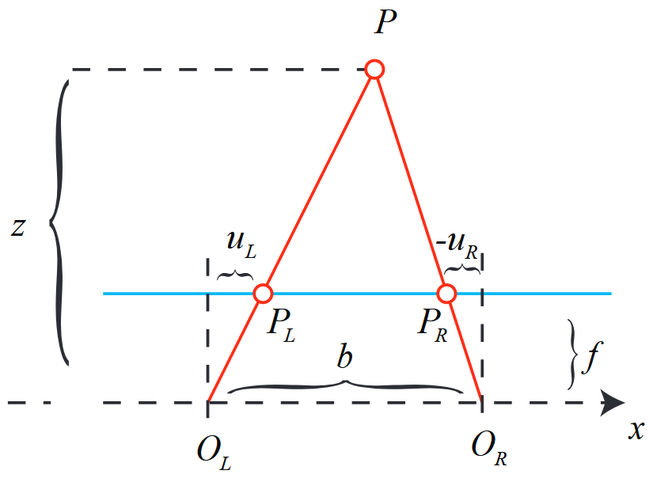

# 第 5 讲  相机与图像
## 相机模型
- 主要讨论**针孔模型**，这种模型简单又强势。
- 由于相机镜头的**透镜**的存在，使光线投影到成像平面的过程中会产生**畸变**。
- 我们用**针孔**和**畸变**这两个模型来描述整个投影过程。
- **针孔**和**畸变**模型能将外部三维点投影到相机成像平面，构成相机的**内参数**。
## 针孔相机模型
- 针孔相机模型如图所示：

- **像素坐标系**与**成像平面**之间，相差了一个**缩放**和一个**原点的平移**。
- 设**像素坐标**在 $u$ 轴上缩放了 $\alpha$ 倍，在 $v$ 轴上缩放了$\beta$ 倍。
这句话实际上是将物体在现实世界的大小转换为了在成像平面中的像素大小。之所以缩放的倍数不一样，是因为单个像素的长宽不一定相等，即像素不一定是正方形。
- **世界坐标到像素坐标的转换**公式如下：
$$
Z\left(\begin{array}{l}u \\ v \\ 1\end{array}\right)=\left(\begin{array}{ccc}f_{x} & 0 & c_{x} \\ 0 & f_{y} & c_{y} \\ 0 & 0 & 1\end{array}\right)\left(\begin{array}{l}X \\ Y \\ Z\end{array}\right) \triangleq \boldsymbol{K} \boldsymbol{P}
$$
- 上式的左侧用到了齐次坐标。中间的矩阵 $\boldsymbol{K}$ 称为相机的**内参矩阵**。
通常，相机的内参在出厂后是固定的，有时可能需要自己确定内参，即所谓的**标定**。
- 由于相机在运动，因此点 $P$ 的**相机坐标**应该是它的**世界坐标 $\boldsymbol{P}_w$** 根据**当前位姿**变换到**相机坐标系**下的结果。
- 相机的位姿由旋转矩阵 $\boldsymbol{R}$ 和平移向量 $\boldsymbol{t}$ 来表示:
$$
Z \boldsymbol{P}_{u v}=Z\left[\begin{array}{l}u \\ v \\ 1\end{array}\right]=\boldsymbol{K}\left(\boldsymbol{R} \boldsymbol{P}_{w}+\boldsymbol{t}\right)=\boldsymbol{K} \boldsymbol{T} \boldsymbol{P}_{w}
$$
上式描述了点 $P$ 的**世界坐标**到**像素坐标**的投影关系。
- 相机的位姿 $\boldsymbol{R},\boldsymbol{t}$ 称为相机的**外参数**。
- 外参随着相机运动而变化，代表了运动轨迹。
### 畸变
透镜会对光线的传播产生两种影响：
1. **径向畸变**：透镜自身形状对光纤传播的影响。
径向畸变分为两大类：**桶形畸变**和**枕形畸变**。
2. **切向畸变**：透镜和成像平面不可能完全平行，会导致光线穿过透镜投影到成像平面时的位置发生变化。
下面通过数学形式对**径向畸变**和**切向畸变**进行描述……
平面上任意点 $p$ 的笛卡尔坐标为 $[x,y]^T$，极坐标为 $[r,\theta]^T$
- **径向畸变**可看成坐标点到原点的距离发生了变化 $\delta r$。
对于**径向畸变**，用一个**多项式函数**来描述畸变前后的坐标变化，这类畸变能用和中心距离 $r$ 有关的二次及高次多项式函数进行修正：
$$
x_{\text {corrected }}=x\left(1+k_{1} r^{2}+k_{2} r^{4}+k_{3} r^{6}\right)\\
y_{\text {corrected }}=y\left(1+k_{1} r^{2}+k_{2} r^{4}+k_{3} r^{6}\right)
$$
&emsp;&emsp;未修正的点 $[x,y]^T$ 和修正后的点 $[x_{corrected},y_{corrected}]^T$ 都是**归一化平面**上的点，而不是像素平面上的点。关于归一化平面，见书上内容。
- **切向畸变**可看成坐标点沿切线方向发生了变化 $\delta \theta$。
对于**切向畸变**，用另外两个参数 $p_1,p_2$ 来进行修正：
$$
x_{\text {corrected }}=x+2 p_{1} x y+p_{2}\left(r^{2}+2 x^{2}\right)\\
y_{\text {corrected }}=y+2 p_{2} x y+p_{1}\left(r^{2}+2 y^{2}\right)
$$
对于**相机坐标系**中的点 $P(X,Y,Z)$，可以通过 5 个**畸变系数**找到该点在像素平面的正确位置，**步骤**如下：
1. 像三维空间点投影到**归一化图像平面**，设归一化坐标为 $[x,y]^T$。
2. 对**归一化平面**上的点进行**径向畸变**和**切向畸变**校正。
$$
\begin{cases}
x_{\text{corrected}} = x\left(1 + k_1 r^2 + k_2 r^4 + k_3 r^6\right) + 2p_1 xy + p_2\left(r^2 + 2x^2\right) \\
y_{\text{corrected}} = y\left(1 + k_1 r^2 + k_2 r^4 + k_3 r^6\right) + 2p_2 xy + p_1\left(r^2 + 2y^2\right)
\end{cases}
$$
3. 将纠正后的点通过**内参矩阵**投影到**像素平面**,得到该点在图像上的正确位置：
$$
\begin{cases}
u = f_x x_{\text{corrected}} + c_x \\
v = f_y y_{\text{corrected}} + c_y
\end{cases}
$$
综上所述,我们一共谈到了四种坐标:世界、相机、归一化相机和像素坐标。一定要理清它们的关系，它反映了整个成像的过程。

### 双目相机模型
&emsp;&emsp;人眼可以根据左右眼的**视差**来判断物体的距离。双目相机的原理亦是如此。通过同步采集左右相机的图像，计算图像间的视差，估计每一个像素的深度。
&emsp;&emsp;**双目相机的几何模型**如图所示：

- $O_L$ 和 $O_R$ 为左右**光圈中心**，蓝色框为**成像平面**，$f$ 为**焦距**，$u_L$ 和 $u_R$ 为成像平面上的坐标。
- 两个**光圈中心**之间的距离称为双目相机的**基线** $b$。
由于 $\triangle PP_LP_R$ 和 $\triangle PO_LO_R$ 相似，有：
$$
\frac{z-f}{z}=\frac{b-u_{L}+u_{R}}{b}
$$
  整理可得：
$$
z = \frac{fb}{d}, \quad d = u_L - u_R
$$
上式中，$d$ 为左右图的横坐标之差，称为**视差**：
1. 通过**视差**可以估计点 $P$ 到相机的距离。
2. **视差**与距离成反比：视差越大，距离越近；视差越小，距离越远。
3. 由于**视差**最小为1像素，因此存在由 $fb$ 确定的最大距离。

虽然公式简单，但是**视差** $d$ 的计算困难。**计算视差**这件事情属于“人觉得容易而计算机觉得困难”的范畴。
- 只有在图像纹理变化丰富的地方才能计算视差。
- 由于计算量大，**双目深度估计**需要使用 GPU 或 FPGA 来计算。
### 5.1.4 RGB-D 相机模型
RGB-D 相机能够**主动测量每个像素的深度**。RGB-D 相机按原理可分为两大类：
1. 通过**红外结构光**来测量像素距离。
2. 通过**飞行时间法**来测量像素距离。

- 在测量深度后，RGB-D 相机会自己完成**深度与彩色图像素之间的配对**，输出一一对应的**彩色图**和**深度图**。
- 我们能在同一个图像位置，读取到**色彩信息**和**距离信息**，计算像素的 3D 相机坐标，生成**点云**。
- 对于 RGB-D 数据，既可以在**图像层面**进行处理，也可在**点云层面**处理。

RBG_D 相机的局限如下：
1. **不能在室外使用！！**
RGB-D 相机用红外进行深度测量，容易受到日光或其它传感器发射的红外光干扰。
2. **同时使用多个 RGB-D 相机会互相干扰！！**
3. 对于**透射材质**的物体，无法测量点的位置。
4. **成本、功耗**方面也有大大的劣势。
## 5.2 图像
在数学中，图像能用矩阵来表示；在计算机中，图像能用**二维数组**来表示。
### 5.2.1 计算机中的图像表示
在灰度图中，每个像素位置 $(x,y)$ 对应一个灰度值 $I$，一张宽度为 $w$，高度为 $h$ 的图像可以表示为：
$$
\boldsymbol{I}(x, y) \in \mathbb{R}^{w \times h}
$$
- 我们用 0-255 之间的整数，即一个字节，来表达图像的灰度大小。
- 图像由像素组成，访问某个像素需要指明它所处的坐标。
- 在 OpenCV 的彩色图像中，通道的默认顺序为 B，G，R。